# 🏙️ Smart City Project - End-to-End Real-Time Data Engineering Pipeline

<div align="center">

[](https://kafka.apache.org/) 
[](https://spark.apache.org/) 
[](https://aws.amazon.com/s3/)
[](https://aws.amazon.com/glue/)
[](https://aws.amazon.com/athena/)
[](https://aws.amazon.com/redshift/)
[](https://min.io/)
[](https://www.docker.com/)

</div>

---
## 🏁 Getting Started

Before running the project, make sure to set up your environment and dependencies.
```bash
# moving to the project's folder
cd to_your_folder_named_smartcity
```

### **1️⃣ Create a Python Virtual Environment**

```bash
# Create a virtual environment named .venv
python3 -m venv .venv
```
#### Activate the virtual environment
##### Linux/macOS:
- source .venv/bin/activate
##### Windows:
- .venv\Scripts\activate
### **2️⃣ Install Python Dependencies**
```bash
Copy code
pip install -r python/requirements.txt
```
### **3️⃣ Start Docker Services**
```bash
Copy code
# Make sure Docker is installed and running
docker-compose up -d
```
- This will start all necessary services including Kafka, Spark, Jupyter, MinIO (or S3), and other components of the pipeline.

### **4️⃣ Verify Services**
- Kafka UI: http://localhost:8090

- Jupyter Notebook: http://localhost:8888

- MinIO Console: http://localhost:9001

- Spark Master: http://localhost:8180

---

## 🏗️ Architecture 🔥


---

<div align="center">

**🔥 Complete end-to-end real-time data engineering pipeline for smart city vehicle & IoT data 🔥**  
*🚀 Streaming, batch processing, AWS integration, analytics-ready storage 🌟*

</div>

---

## 🐳 Dockerized Services

### Apache Kafka Cluster
- **Broker**: `confluentinc/cp-kafka:7.6.1`
- **Schema Registry**: `confluentinc/cp-schema-registry:7.6.1`
- **Kafka Connect**: `confluentinc/cp-kafka-connect:7.7.1`
- **Kafka UI**: `provectuslabs/kafka-ui:latest`

**Key Configuration Highlights**:
- `KAFKA_ADVERTISED_LISTENERS`, `LISTENERS`, `INTER_BROKER_LISTENER_NAME` configured for local and container networking.
- JMX metrics enabled via Prometheus agent (`jmx_prometheus_javaagent.jar`).
- Kafka Connect configured with `AvroConverter` for schema registry integration.

### Apache Spark Cluster
- **Master**: Custom Spark Dockerfile
- **Workers**: 2 workers with Jupyter Notebook for testing


**Spark Config Highlights**:
- Dcoker file has been built for downloading image and jars needed for Kafka and AWS
- S3a connector configured for AWS: `fs.s3a.access.key`, `fs.s3a.secret.key`, `fs.s3a.endpoint`, `fs.s3a.connection.ssl.enabled`.
- Commit protocol: `SQLHadoopMapReduceCommitProtocol` with `directory` committer for Parquet.

### MinIO (Storage Testing)
- MinIO container for local S3 testing
- Switched to AWS S3 for production

### Jupyter (Spark Testing)
- Jupyter container for local Spark Streaming testing
- Switched to spark-master container for production
---

## 📊 Data Flow Overview

1. **Simulation & Kafka Producers**: Vehicle, GPS, Traffic, Weather, Emergency data generated via Python scripts and pushed to Kafka topics.  
2. **Spark Structured Streaming**: Streams data from Kafka, applies schemas, transformations, and writes to **S3** in **Parquet format**.  
3. **AWS Glue Crawlers**: Automatically catalog data stored in S3, creating tables in the Data Catalog.  
4. **Query with Athena**: Run SQL queries directly on S3 data using AWS Athena.  
5. **Redshift Integration**: Load curated data from Glue Data Catalog into Redshift for analytics.  

---

## 📦 Simulation and Kafka Configuration

**Topics**:

| Topic | Description |
|-------|-------------|
| `vehicle_data` | Real-time vehicle telemetry |
| `gps_data` | GPS location and speed |
| `traffic_data` | Traffic camera snapshots |
| `weather_data` | Weather conditions |
| `emergency_data` | Emergency incidents |

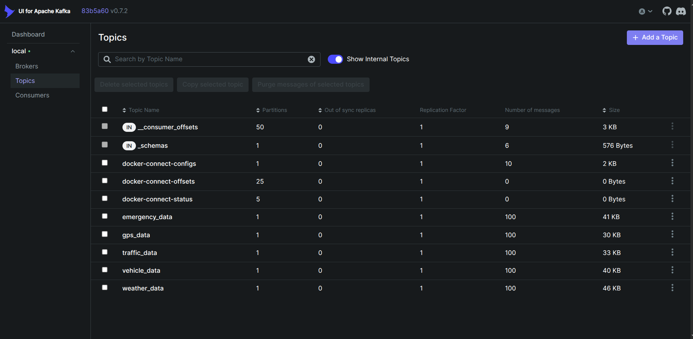 


**Simulation Details**:  

- Vehicle moves from **London → Birmingham**  
- Incremental lat/lon updates with randomization for realism  
- JSON messages produced to Kafka with structured schemas  
- When you run main.py
  
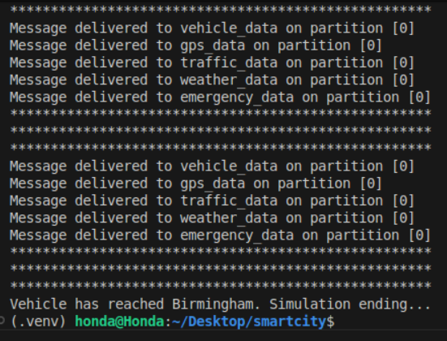 

---

## ⚡ Spark Structured Streaming

- Reads Kafka topics using **Spark Structured Streaming**  
- Applies schemas for each type of data  
- Writes streaming data to **S3 buckets** with checkpointing
**Example S3 Paths**:
  - s3a://smart-city-project1/data/vehicle_data
  - s3a://smart-city-project1/checkpoints/vehicle_data
- To run spark_city.py

```bash
docker exec -it spark-master bash
```
then after entering the container
```bash
spark-submit python/spark_city.py
```
then wait till it runs
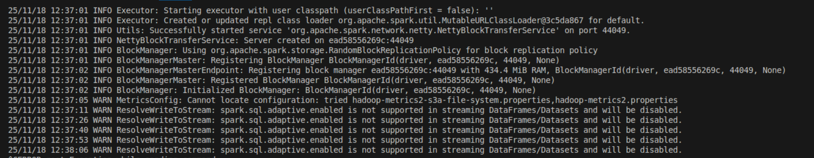 

---

## ☁️ AWS S3 & Glue Integration

### **S3 Bucket Structure**

- `data/vehicle_data/`  
- `data/gps_data/`  
- `data/traffic_data/`  
- `data/weather_data/`  
- `data/emergency_data/`  

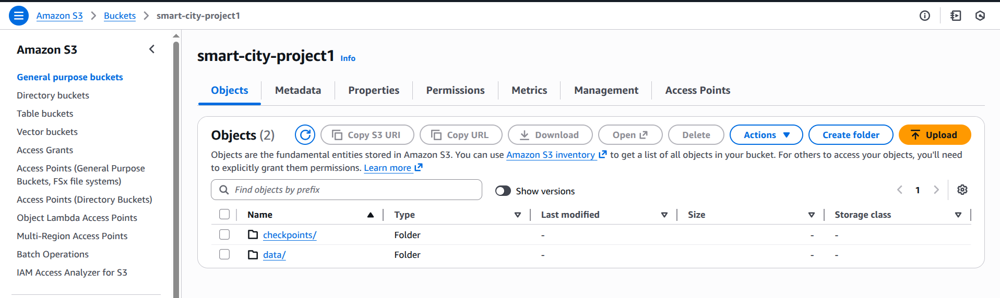  

### **Glue Crawlers**

- Configured to scan **S3 data folders**  
- Automatically detect schema and create/update **tables in AWS Data Catalog**  
- Crawlers run on schedule or on-demand  

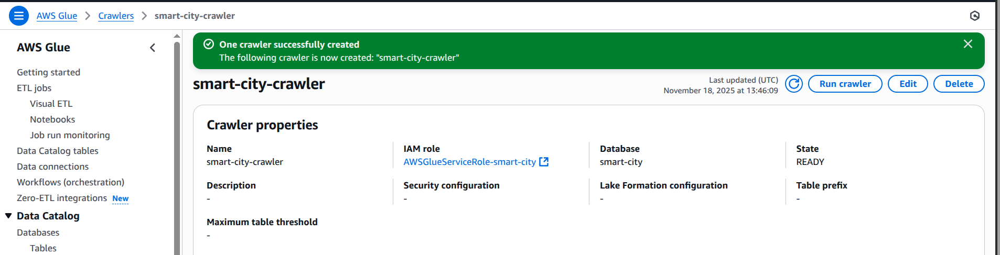  
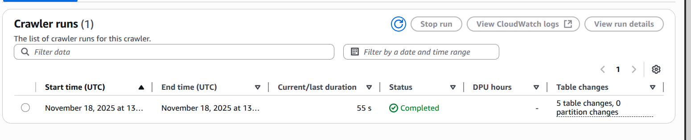  

### **Data Catalog**

- Tables created for each Kafka topic  
- Schema automatically inferred from Parquet files  

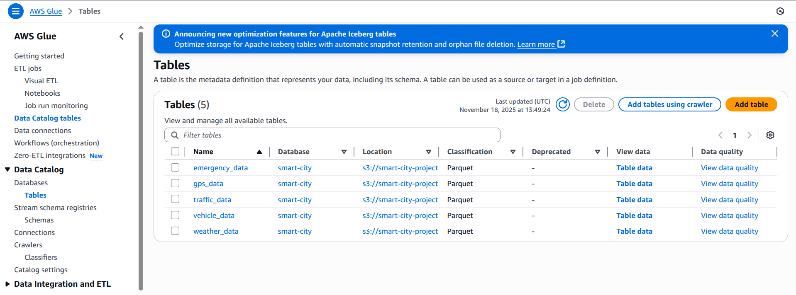  
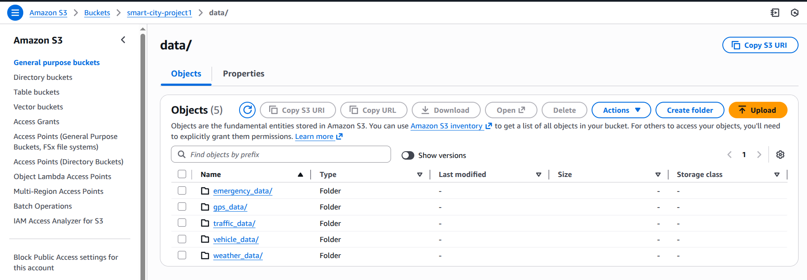  

---

## 🧩 Querying Data with Athena

- Athena connects directly to Glue Data Catalog tables  
- Run SQL queries on **S3 data without loading into Redshift**  

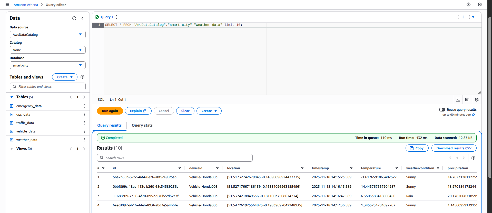  

**Example Query**:

```sql
SELECT deviceId, AVG(speed) AS avg_speed
FROM vehicle_data
WHERE timestamp >= DATE '2025-11-18'
GROUP BY deviceId;
```

## 🏢 Redshift Integration

- Configured Redshift cluster
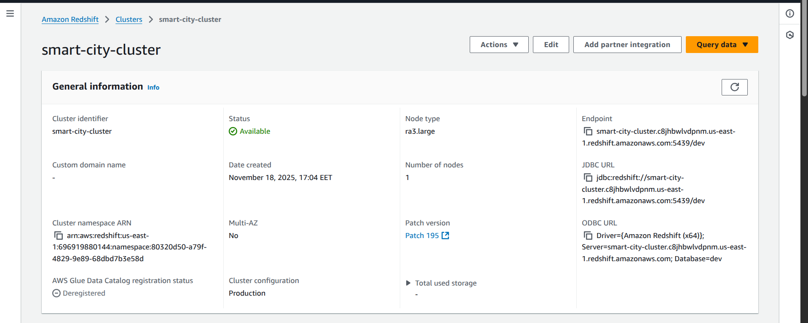  

- Used Vs code Database extension to connect to Redshift
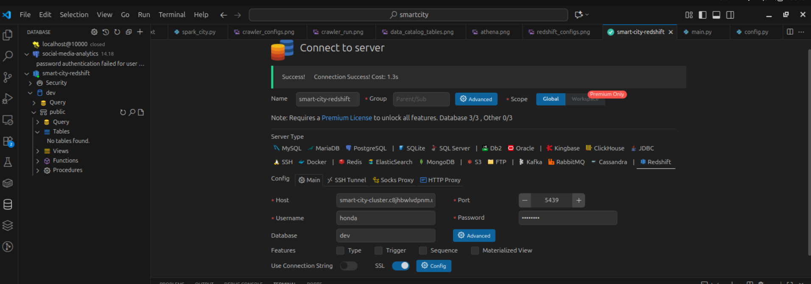  

- Connected Redshift to AWS Glue Data Catalog 

- Loaded tables into Redshift for analytics and dashboarding

- Verified schema & queried using Redshift SQL

 


### 🚀 Key Achievements

- Real-time vehicle tracking & analytics

- Automated schema management using Glue crawlers

- Querying large-scale data efficiently using Athena & Redshift

- End-to-end streaming + batch + cloud integration

- Optimized Spark Structured Streaming pipeline with checkpointing

---

## 🙏 Credits

Special thanks to **[CodeWithYu](https://www.youtube.com/@codewithyu)** for the guidance and inspiration throughout this project.
